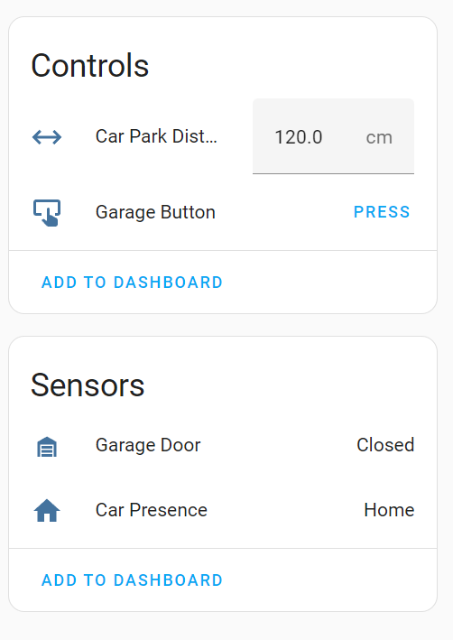
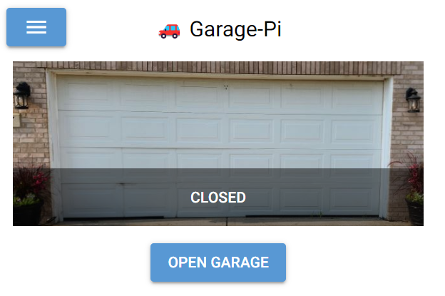
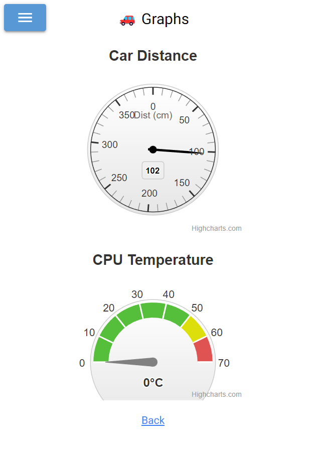
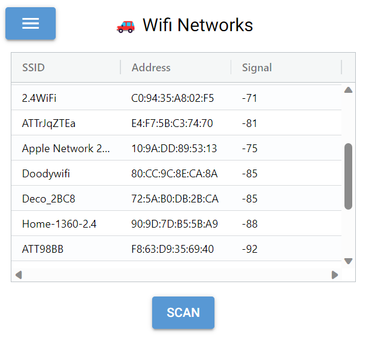
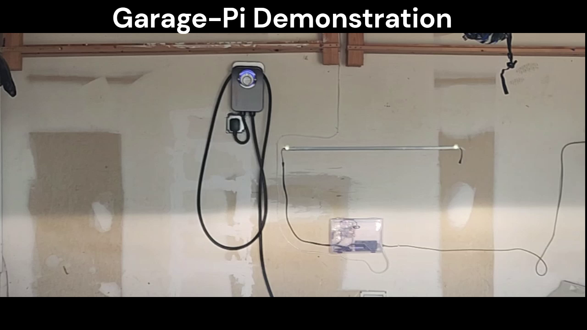
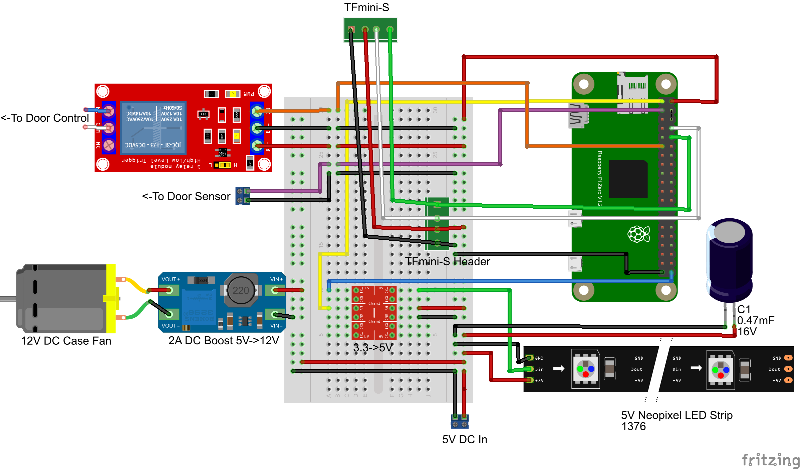
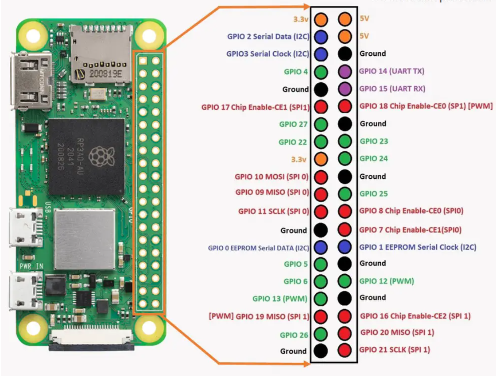
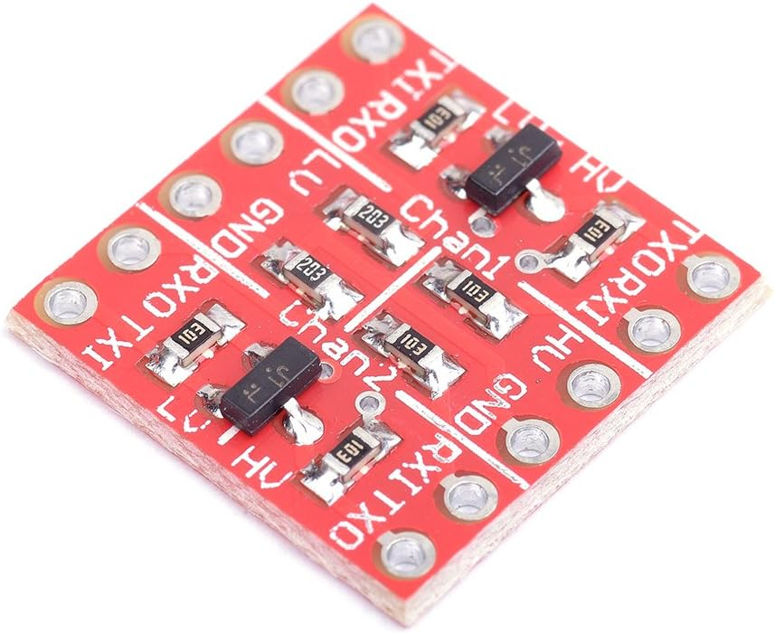
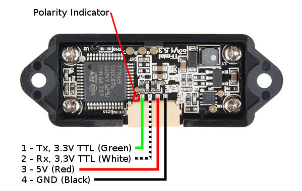
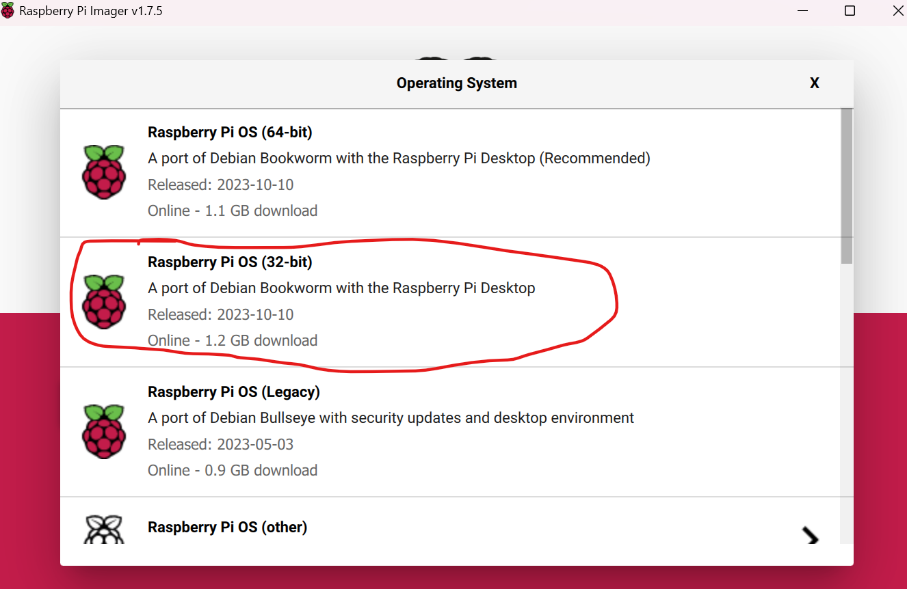

# Garage-Pi

**by John Dillenburg (john@dillenburg.org)**

This project turns a Raspberry-Pi (3, 4, 5, or Zero-2W) into a Garage helper with features including:
* Open/Close garage door using 5V relay
* Determine Open/Close status via contact switch
* TFmini-S and Neopixel integration to display distance from car to front of garage
* [Home Assistant](https://www.home-assistant.io/) integration via MQTT 
  * Garage door device is auto-configured
  * Status of door (open/closed) and car (parked/not parked)
  * Open/close the garage door
  * Configure park distance
  * Tasker/AutoRemote integration (garage-pi pushes open/close status to AutoRemote)
* [NiceGUI](https://nicegui.io/) website
  * HTTPS and password protected
  * Open/close garage door
  * Graphs of car distance and CPU temperature
  * Scan to see if your car emits Wifi signal
  * Status of sensors
  * API end points for open/close status and control
* Option to auto-open and close based on detecting car's WiFi signal
* [Tasker](https://play.google.com/store/apps/details?id=net.dinglisch.android.taskerm) integration via [AutoRemote](https://play.google.com/store/search?q=autoremote&c=apps)
to receive open/close status and to send open/close commands

## Disclaimer
This project will be connected to your garage door opener and will be able to remotely open and close your
door using Home Assistant, via your local WiFi network, and over the Internet.  This is an obvious security concern you should weigh before starting this project.  HTTPS
and passwords are used to somewhat alleviate security concerns.  

Also, because this project is connected to your door opener's sensor and control directly, any type of power 
surge will fry the Pi and other connected components.  It wouldn't hurt to add some fuses and optical isolation
if you are worried about that.

## Screenshots
Here are some obligatory screenshots, so you can figure out if this is what you want or not.
### Home Assistant

### Built-In Web Site



## Demo
Screenshots not enough? This video shows how Garage-Pi displays the Neopixel strip of lights as a car approaches its parking distance from the front of the garage.
[](readme_assets/demo.mp4 "Video")
## Command Line
If you run garage-pi with --help, the command line will be explained:
```
garage.py --help
usage: garage.py [-h] [-c CONFIG] [--ssid SSID] [--tfmini_port TFMINI_PORT] [--park_distance PARK_DISTANCE] [--max_distance MAX_DISTANCE]
                 [--neopixel_pin NEOPIXEL_PIN] [--num_pixels NUM_PIXELS] [--wlan WLAN] [--web_host WEB_HOST] [--storage_secret STORAGE_SECRET]
                 [--door_status_pin DOOR_STATUS_PIN] [--door_control_pin DOOR_CONTROL_PIN] [--mqtt_server MQTT_SERVER]
                 [--mqtt_discovery_prefix MQTT_DISCOVERY_PREFIX] [--mqtt_device_id MQTT_DEVICE_ID] [--mqtt_device_name MQTT_DEVICE_NAME]
                 [--mqtt_username MQTT_USERNAME] [--mqtt_password MQTT_PASSWORD] [--passwords PASSWORDS] [--db_file DB_FILE]
                 [--auto_open_cool_down AUTO_OPEN_COOL_DOWN] [--door_movement_delay DOOR_MOVEMENT_DELAY] [--disable_tfmini] [--disable_wifi] [--disable_web]
                 [--disable_auto_open_via_wifi] [--disable_auto_close_via_wifi] [--disable_mqtt] [--autoremote_key AUTOREMOTE_KEY]

Args that start with '--' (eg. --ssid) can also be set in a config file (/etc/garage.conf or /root/garage.conf or specified via -c). Config file syntax allows:
key=value, flag=true, stuff=[a,b,c] (for details, see syntax at https://goo.gl/R74nmi). If an arg is specified in more than one place, then commandline values
override config file values which override defaults.

optional arguments:
  -h, --help            show this help message and exit
  -c CONFIG, --config CONFIG
                        config file to load
  --ssid SSID           enable Wifi and scan for given ssid
  --tfmini_port TFMINI_PORT
                        TFmini-S port to use, defaults to /dev/ttyS0
  --park_distance PARK_DISTANCE
                        set TFmini-S park_distance to given value in centimeters, defaults to 94 cm
  --max_distance MAX_DISTANCE
                        set TFmini-S max_distance to given value in centimeters, defaults to 390 cm
  --neopixel_pin NEOPIXEL_PIN
                        Neopixel data line is connected to this pin, see Adafruit blinka library Board class
  --num_pixels NUM_PIXELS
                        number of NeoPixels, defaults to 60
  --wlan WLAN           wireless interface to use for ssid scanning, defaults to wlan0
  --web_host WEB_HOST   start web server and bind to given host
  --storage_secret STORAGE_SECRET
                        secret key for browser based storage, default is `garage-pi-4-ever`, a value is required to encrypt login)
  --door_status_pin DOOR_STATUS_PIN
                        Door status pin, passed to gpiozero Button to monitor garage door open/close status, defaults to 2
  --door_control_pin DOOR_CONTROL_PIN
                        Door control pin, passed to gpiozero OutputDevice to trigger garage door open/close relay, defaults to 17
  --mqtt_server MQTT_SERVER
                        FQDN of MQTT server to send status updates to
  --mqtt_discovery_prefix MQTT_DISCOVERY_PREFIX
                        MQTT discovery_prefix portion of topic to publish configuration and status to, defaults to homeassistant
  --mqtt_device_id MQTT_DEVICE_ID
                        MQTT device identifier to use in publications, defaults to 01ad
  --mqtt_device_name MQTT_DEVICE_NAME
                        MQTT device name to use in publications, defaults to "Garage Door"
  --mqtt_username MQTT_USERNAME
                        MQTT server username to login
  --mqtt_password MQTT_PASSWORD
                        MQTT server password to login
  --passwords PASSWORDS
                        passwords are loaded from this json file
  --db_file DB_FILE     store persistent variables in this file, defaults to garage_vars
  --auto_open_cool_down AUTO_OPEN_COOL_DOWN
                        amount of time in seconds to wait after car exits before considering opening the door, defaults to 300 seconds
  --door_movement_delay DOOR_MOVEMENT_DELAY
                        how long to wait for door to open or close before considering it a failure when door_status_pindoes not change its reading, defaults to 10
                        seconds
  --disable_tfmini      disables TFmini-S usage
  --disable_wifi        disables Wifi usage
  --disable_web         disables web interface
  --disable_auto_open_via_wifi
                        disable auto open via Wifi
  --disable_auto_close_via_wifi
                        disable auto close via Wifi
  --disable_mqtt        disables MQTT integration
  --autoremote_key AUTOREMOTE_KEY
                        Tasker auto-remote key to send garage-opened and garage-closed messages to

```
Command line options can also be saved to a file that is loaded via the --config=FILE command line option. 
```
$ cat garage.conf
ssid=My Wifi
tfmini_port=/dev/ttyS0
park_distance=104
max_distance=390
mqtt_server=homeassistant.local
mqtt_username=homeassistant
mqtt_password=password-to-your-mqtt-server
autoremote_key=Tasker-autoremote-key
$ python3 --config=garage.conf
```
By default, ~/garage.conf is loaded so if you pace garage.conf in your $HOME directory, it will be loaded by simply running garage.py:
```
$ python3 garage.py
```
## Installation
Garage-Pi requires some assembly and soldering skills in addition to software installation.  Here is a list of equipment that was used in my installation.
### Hardware Assembly
#### Parts List
(Note: Links marked "Amazon" are Affiliate links and will earn money for me.)

| Item                                   | Price (USD) | Buy Link                                                                                                                                                                                                                                                                                                                                                                                    |
|----------------------------------------|-------------|---------------------------------------------------------------------------------------------------------------------------------------------------------------------------------------------------------------------------------------------------------------------------------------------------------------------------------------------------------------------------------------------|
| Raspberry Pi Zero 2W                   | $15.00      | [SparkFun](https://www.sparkfun.com/products/18713?src=raspberrypi)                                                                                                                                                                                                                                                                                                                         |
| 32GB MicroSD Memory Card               | $10.71      | [Amazon](https://www.amazon.com/gp/product/B06XWMQ81P/ref=ppx_yo_dt_b_search_asin_title?ie=UTF8&amp;psc=1&_encoding=UTF8&tag=amazonjohn07f-20&linkCode=ur2&linkId=e3a3bf5e0569163df8c88c21333d0f78&camp=1789&creative=9325)                                                                                                                                                                 |
| Raspberry Pi Zero 2W Case              | $9.89       | [Amazon](https://www.amazon.com/gp/product/B075FLGWJL/ref=ppx_yo_dt_b_search_asin_title?ie=UTF8&amp;th=1&_encoding=UTF8&tag=amazonjohn07f-20&linkCode=ur2&linkId=694770aff795ccdb015d84dc21b93e9d&camp=1789&creative=9325)                                                                                                                                                                  |
| 5V Relay Module 8-pack                 | $11.99      | [Amazon](https://www.amazon.com/gp/product/B09G6H7JDT/ref=ppx_yo_dt_b_search_asin_title?ie=UTF8&amp;psc=1&_encoding=UTF8&tag=amazonjohn07f-20&linkCode=ur2&linkId=a56ce9dcd27e755bd94e1f00805aefb0&camp=1789&creative=9325)                                                                                                                                                                 |
| TFmini-S                               | $47.85      | [Amazon](https://www.amazon.com/gp/product/B09WDWFW21/ref=ppx_yo_dt_b_search_asin_title?ie=UTF8&amp;psc=1&_encoding=UTF8&tag=amazonjohn07f-20&linkCode=ur2&linkId=7362245319d2cd58e64a60fba5464729&camp=1789&creative=9325)                                                                                                                                                                 |
| 12V DC Fan 2-pack                      | $13.98      | [Amazon](https://www.amazon.com/ANVISION-Bearing-Brushless-Cooling-YDM4010B12/dp/B0711FVD48/ref=sr_1_4?crid=3NAYFNGPGZ72U&amp;keywords=small%252B12v%252Bdc%252Bfan&amp;qid=1698788735&amp;sprefix=small%252B12v%252Bdc%252Bfan%252B%252Caps%252C103&amp;sr=8-4&amp;th=1&_encoding=UTF8&tag=amazonjohn07f-20&linkCode=ur2&linkId=29cbc948cbb01b8f02c3846da9a491dc&camp=1789&creative=9325)  |
| NeoPixel 5V LED Strip                  | $20.99      | [Amazon](https://www.amazon.com/gp/product/B09MVZ5DZM/ref=ppx_yo_dt_b_search_asin_title?ie=UTF8&amp;th=1&_encoding=UTF8&tag=amazonjohn07f-20&linkCode=ur2&linkId=59b0ec4ec9f23567de283beb54ad7a95&camp=1789&creative=9325)                                                                                                                                                                  |
| 5V 5A Power Supply                     | $15.99      | [Amazon](https://www.amazon.com/gp/product/B08744HPRN/ref=ppx_yo_dt_b_search_asin_title?ie=UTF8&amp;th=1&_encoding=UTF8&tag=amazonjohn07f-20&linkCode=ur2&linkId=294d1459a701c9db4e703a09ed8680e0&camp=1789&creative=9325)                                                                                                                                                                  |            
| Case (I used a leftover packaging box) | Free?       |                                                                                                                                                                                                                                                                                                                                                                                             |
| Solderable breadboard 5-pack           | $11.99      | [Amazon](https://www.amazon.com/gp/product/B07HNKJNK3/ref=ppx_yo_dt_b_search_asin_title?ie=UTF8&amp;psc=1&_encoding=UTF8&tag=amazonjohn07f-20&linkCode=ur2&linkId=c71241a09ce8fa4c9c3acf3a2e233c89&camp=1789&creative=9325)                                                                                                                                                                 |
| Jumper wires                           | $9.29       | [Amazon](https://www.amazon.com/gp/product/B077X99KX1/ref=ppx_yo_dt_b_search_asin_title?ie=UTF8&amp;psc=1&_encoding=UTF8&tag=amazonjohn07f-20&linkCode=ur2&linkId=97a3ab5ea609179bb98116fad01dc373&camp=1789&creative=9325)                                                                                                                                                                 |
| Capacitors 320-pack                    | $19.99      | [Amazon](https://www.amazon.com/gp/product/B08L5ZL87P/ref=ppx_yo_dt_b_search_asin_title?ie=UTF8&amp;th=1&_encoding=UTF8&tag=amazonjohn07f-20&linkCode=ur2&linkId=c540c84c9f91f7771dd74f0c2742c62e&camp=1789&creative=9325)                                                                                                                                                                  |
| Logic Level Converter 3.3V->5V 10-pack | $7.39       | [Amazon](https://www.amazon.com/gp/product/B073D4DJDC/ref=ppx_yo_dt_b_search_asin_title?ie=UTF8&amp;psc=1&_encoding=UTF8&tag=amazonjohn07f-20&linkCode=ur2&linkId=f87eac1e4578b48618f69a8beff7c5c2&camp=1789&creative=9325)                                                                                                                                                                 |
| DC-DC Boost Converter 10-pack          | $7.99       | [Amazon](https://www.amazon.com/gp/product/B089Y7NDCR/ref=ppx_yo_dt_b_search_asin_image?ie=UTF8&amp;psc=1&_encoding=UTF8&tag=amazonjohn07f-20&linkCode=ur2&linkId=fadbf9bffe9674b3f94d2bc25a5eb8e4&camp=1789&creative=9325)                                                                                                                                                                 |
| TOTAL                                  | $142.21     |                                                                                                                                                                                                                                                                                                                                                                                             | 

Note that some of the above items come in packs so you will have leftover DC relays, a fan, DC boost converters, and solderable breadboards.  The total
reflects the per-item cost and not the price.
#### Circuit Diagram


#### Raspberry Pi Zero 2W 
Although any model of Raspberry Pi will work for this project, I recommend using a Zero 2W.  Why?
I tried a Pi 4 and discovered that it overheated very easily in my garage during late July and August.
The Zero 2W is much more tolerant of the temperature extremes your garage may be subjected to.



Here is a table showing what the Pi pins get connected to. 

| Pi Pin       | Connect To                                                                                                                                                                        | 
|--------------|-----------------------------------------------------------------------------------------------------------------------------------------------------------------------------------|
| 3.3V         | Logic Level Converter "LV" pin                                                                                                                                                    |
| 5V           | 5V DC positive (+)                                                                                                                                                                |
| Ground       | <ul><li>5V DC GND</li><li>NeoPixels GND</li><li>DC Boost GND</li><li>Logic Level GND</li><li>TFmini-S GND</li><li>Capacitor (-)</li><li>Control Relay GND</li><li>Sensor GND</li> |
| GPIO 14 (TX) | TFmini-S RX                                                                                                                                                                       |
| GPIO 15 (RX) | TFmini-S TX                                                                                                                                                                       |
| GPIO 21      | One of the Logic Level Converter TXI pins, either will do, just match up the corresponding TXO with the NeoPixel data line                                                        |
| GPIO 2       | Garage door opener's open/close sensor pin                                                                                                                                        |
| GPIO 3       | Status LED positive (Optional for debugging, not used in final system)                                                                                                            |
| GPIO 17      | Control Relay "IN"                                                                                                                                                                |

#### NeoPixels
Theory of operation - the NeoPixel LED strip will display the distance from the TFmini-S sensor to the vehicle entering the garage.  A vehicle that is
far away, near the end of the TFmini-S's range, will display as two pixels, one on each end of the strip.  As the vehicle approaches,
more and more LEDs will light up until the entire strip is colored in.  At this point, the lights switch to a red color to indicate that
the driver should stop the vehicle since it is located at the desired parking distance from the TFmini-S sensor. 

To connect the NeoPixels to the Raspberry Pi Zero 2W, a logic level converter is used to convert the Pi's 3.3V logic to the 
NeoPixel's 5V logic.  See below.

#### Control Relay
The 5V Control Relay is used to "push" the garage door opener's button.  This triggers the door to open or close.


#### Logic Level Converter
The logic level converter is used to convert the Pi's 3.3V GPIO logic to 5V logic for the NeoPixels.



#### TFmini-S

The "time of flight" TFmini-S is the most expensive part of this project, so you'll want to be extra careful with the
connections to it.  You probably do not want to accidentally wire up ground and +5V backwards.



Note that I placed a generous helping of hot-melt glue on the TFmini-S connector.  It is soldered down to the 
circuit board but I found that it can easily break off while making connections and installing it on
the outside of the case.

#### Case Fan
I did end up including a case fan in this design.  This is optional since I never noticed the 2W 
overheating, even when the case fan eventually failed.  I do live in a northern climate, however, so 
make the case fan choice based on how hot your garage gets.  Also note that you could
substitute a 5V fan and forgo the 5V to 12V DC boost converter.

#### Assembled Circuit


I screwed the solderable breadboard down to a leftover case that used to have an
assortment of screws in it.  I then screwed the case to the front wall of my garage. The TFmini-S was fastened down to the top of the case so that it faces my car as it
pulls into the garage.  THe TFmini-S is mounted at about the height of my car's bumper.

### Software
The software consists of the Raspbian operating system, some shell scripts, python code, and python libraries.
1. Write Raspbian OS to 32GB SD Card
2. Install Python
3. Install Garage-Pi
4. Configure HTTPS
5. Configure Garage-Pi 

Each of these steps will be discussed below.

#### Raspbian Operating System
You will need to use another computer to write the Raspbian OS image to the 32GB MicroSD card.  See [Raspberry Pi OS Imager](https://www.raspberrypi.com/software/).
For the O.S., choose Raspberry Pi OS (32-bit).


After you write the O.S. image to your micro-SD and insert it into the Pi, you will need to connect
a keyboard, mouse and monitor until you have remote SSH access working.

You might want to check out [SparkFun](https://learn.sparkfun.com/tutorials/getting-started-with-the-raspberry-pi-zero-2-w/all). They have a nice 
tutorial on getting started with the Raspberry Pi Zero 2W.

#### Enable WiFi on your Pi

You will need an active Internet connection to install the Garage-Pi software, Python,
and Python libraries.

To connect Raspberry Pi Zero W to WiFi, you can:
1. Use the WiFi icon on the Desktop to select and join a network ([link](https://www.bing.com/ck/a?!&&p=5fb4edd1cdb59150JmltdHM9MTY5ODk2OTYwMCZpZ3VpZD0wMzYwZDgzMi1jODMwLTZlODYtMDllZC1jOTVkYzk5ODZmOWMmaW5zaWQ9NTUyOA&ptn=3&hsh=3&fclid=0360d832-c830-6e86-09ed-c95dc9986f9c&psq=setup+wifi+on+raspberry+pi+zero+&u=a1aHR0cHM6Ly9sZWFybi5zcGFya2Z1bi5jb20vdHV0b3JpYWxzL2dldHRpbmctc3RhcnRlZC13aXRoLXRoZS1yYXNwYmVycnktcGktemVyby13aXJlbGVzcy9hbGwjOn46dGV4dD1UaGUlMjBQaSUyMFplcm8lMjBXJTIwaGFzJTIwYnVpbHQlMjBpbiUyMFdpRmklMkMsb2YlMjBhdmFpbGFibGUlMjBuZXR3b3Jrcy4lMjBTZWxlY3QlMjB0aGUlMjBvbmUlMjB5b3UlMjB3YW50Lg&ntb=1)).
2. Edit the /etc/wpa_supplicant/wpa_supplicant.conf file and add your network name and password, then reboot your Pi ([link](https://raspberrypi.stackexchange.com/questions/68442/how-to-connect-pi-zero-w-to-the-internet#:~:text=All%20you%20have%20to%20do%20is%20go%20into,will%20have%20to%20use%20sudo%20to%20edit%20wpa_supplicant.conf)).
3. Use the sudo iwlist wlan0 scan command to see the available networks, then edit the /etc/wpa_supplicant/wpa_supplicant.conf file and add your network name and password, then reboot your Pi ([link](https://www.bing.com/ck/a?!&&p=d03aa546f0d887b5JmltdHM9MTY5ODk2OTYwMCZpZ3VpZD0wMzYwZDgzMi1jODMwLTZlODYtMDllZC1jOTVkYzk5ODZmOWMmaW5zaWQ9NTUzMA&ptn=3&hsh=3&fclid=0360d832-c830-6e86-09ed-c95dc9986f9c&psq=setup+wifi+on+raspberry+pi+zero+&u=a1aHR0cHM6Ly93d3cuaW5zdHJ1Y3RhYmxlcy5jb20vQ29ubmVjdC1SUEktWmVyby1XLXRvLVdpZmkvIzp-OnRleHQ9Q29ubmVjdCUyMFJQSSUyMFplcm8lMjBXJTIwdG8lMjBXaWZpJTNBJTIwMS5zdWRvJTIwaXdsaXN0LCUyOHRoaXMlMjBpcyUyMHdoZXJlJTIweW91JTIwYWRkJTIwdGhlJTIwd2lmaSUyMG5ldHdvcmslMjk0Lg&ntb=1)).

#### Python
Once your Pi is connected to the network, Python can be installed with the following commands:
```
sudo apt update
sudo apt upgrade
sudo apt install python3 -y
```
Verify that you have at least Python 3.9:
```
python -V
```

#### Garage-Pi Code
You can download the Garage-Pi code by using the 'git' command:
```
git clone https://github.com/jdillenburg/garage-pi.git
```

I like to create a virtual environment so the libraries needed do not interfere with other python programs you
may want to install later:
```
cd garage-pi
python -m venv venv
```
This creates a venv directory containing the custom python libraries we will need.
```
source venv/bin/activate
```
This switches the python and pip commands to use the venv python environment.
```
pip3 install -r requirements.txt
```
This installs the required libraries.

#### Why Sudo is Required
If you run garage.py as a normal user, then you will see the following error:
```
$ python3 garage.py
Can't open /dev/mem: Permission denied
RuntimeError: NeoPixel support requires running with sudo, please try again!
```
This is normal and is caused by the [adafruit-circuitpython-neopixel](https://github.com/adafruit/Adafruit_CircuitPython_NeoPixel) library.  You can run 
garage.py as root to avoid the error:
```
$ sudo python3 garage.py
```
This is a large security flaw, however, since we are providing an externally accessible website.
There is an explanation on the Adafruit NeoPixel page on how to use GPIO10 and raspi-config to avoid
the use of sudo.  I haven't tried this.

#### Edit passwords.json

You will need to edit the passwords.json file that comes with this code and place a username and password into it. This username and password will be needed to access the NiceGUI website on port 8080.
```
$ cat passwords.json
{"default": "changethis"}
```
You can place as many username and password pairs in the file as you like.

#### Run Garage-Pi

To start up Garage-Pi from the command line in the garage-pi directory you checked out from GitHub, simply pass
the garage.py script to python.  Don't forget to activate your Python virtual environment first:
```
source venv/bin/activate
sudo venv/bin/python3 garage.py
```
If all goes well, you should something like the following:
```
NiceGUI ready to go on http://localhost:8080, and http://127.0.1.1:8080 (install netifaces to show all IPs and speedup this message)
```
If you point a web browser at the address of your garage-pi at port 8080, you should see the login screen:


#### Enable Remote SSH Login

I'm assuming you have another computer that you can use to remotely access your garage-pi after you install
it in your garage.  You are probably will not want to keep a keyboard and monitor in your garage along with the 
Raspberry Pi.  Use the raspi-config command to enable SSH.

```
sudo raspi-config
```

Go to Interface options, SSH, then select Yes.  Make sure you can remote login before moving your 
Pi to your garage and wiring it to your door and opener.

#### Disable the Desktop Graphical User Interface

Note that the graphical desktop interface will not be needed and should be disabled using raspi-config.  I found in my testing
that the lxpanel process of the desktop GUI uses up a lot of CPU cycles.  Navigate to System Options, Boot, and select 
Console without login.

```
sudo raspi-config
```

# Acknowledgements
This system was inspired by [ResinChem Tech's](https://www.youtube.com/@ResinChemTech) "[A New Parking Assistant using ESP8266 and WS2812b LEDs](https://www.youtube.com/watch?v=HqqlY4_3kQ8)" video on YouTube.  It is an excellent system and video so I encourage you to go watch it.  His system displays the LEDs the same
way as Garage-Pi and has Home Assistant integration as well.  There is no Door or WiFi Sensors and no Door Open/Close Control, however.
