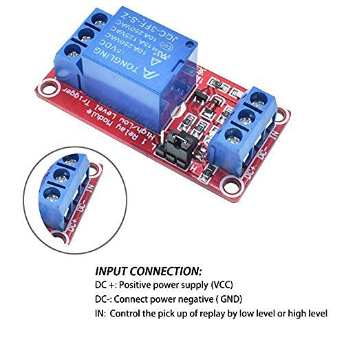

# Garage-Pi
**by John Dillenburg (john@dillenburg.org)**

This project turns a Raspberry-Pi (3, 4, 5, or Zero-2W) into a Garage helper with features including:
* Open/Close garage door using 5V relay
* Determine Open/Close status via contact switch
* TFmini-S and Neopixel integration to display distance from car to front of garage
* Home Assistant integration via MQTT 
  * Garage door device is auto-configured
  * Status of door (open/closed) and car (parked/not parked)
  * Open/close the garage door
  * Configure park distance
  * Tasker/AutoRemote integration (garage-pi pushes open/close status to AutoRemote)
* NiceGUI website
  * HTTPS and password protected
  * Open/close garage door
  * Graphs of car distance and CPU temperature
  * Scan to see if your car emits Wifi signal
  * Status of sensors
  * API end points for open/close status and control
* Option to auto-open and close based on detecting car's WiFi signal

# Disclaimer
This project will be connected to your garage door opener and will be able to remotely open and close your
door using Home Assistant, via your local WiFi network, and over the Internet.  This is an obvious security concern you should weigh before starting this project.  HTTPS
and passwords are used to somewhat alleviate security concerns.  

Also, because this project is connected to your door opener's sensor and control directly, any type of power 
surge will fry the Pi and other connected components.  It wouldn't hurt to add some fuses and optical isolation
if you are worried about that.

## Screenshots
Here are some obligatory screenshots, so you can figure out if this is what you want or not.
### Home Assistant

### Built-In Web Site

## Demo
Screenshots not enough? This video shows how Garage-Pi displays the Neopixel strip of lights as a car approaches its parking distance from the front of the garage.

## Installation
Garage-Pi requires some assembly and soldering skills in addition to software installation.  Here is a list of equipment that was used in my installation.
### Hardware Assembly
#### Parts List
(Note: Links marked "Amazon" are Affiliate links and will earn money for me.)

| Item                                   | Price (USD) | Buy Link                                                                                                                                                                                                                                                                                                                                                                                    |
|----------------------------------------|-------------|---------------------------------------------------------------------------------------------------------------------------------------------------------------------------------------------------------------------------------------------------------------------------------------------------------------------------------------------------------------------------------------------|
| Raspberry Pi Zero 2W                   | $15.00      | [SparkFun](https://www.sparkfun.com/products/18713?src=raspberrypi)                                                                                                                                                                                                                                                                                                                         |
| 32GB MicroSD Memory Card               | $10.71      | [Amazon](https://www.amazon.com/gp/product/B06XWMQ81P/ref=ppx_yo_dt_b_search_asin_title?ie=UTF8&amp;psc=1&_encoding=UTF8&tag=amazonjohn07f-20&linkCode=ur2&linkId=e3a3bf5e0569163df8c88c21333d0f78&camp=1789&creative=9325)                                                                                                                                                                 |
| Raspberry Pi Zero 2W Case              | $9.89       | [Amazon](https://www.amazon.com/gp/product/B075FLGWJL/ref=ppx_yo_dt_b_search_asin_title?ie=UTF8&amp;th=1&_encoding=UTF8&tag=amazonjohn07f-20&linkCode=ur2&linkId=694770aff795ccdb015d84dc21b93e9d&camp=1789&creative=9325)                                                                                                                                                                  |
| 5V Relay Module 8-pack                 | $11.99      | [Amazon](https://www.amazon.com/gp/product/B09G6H7JDT/ref=ppx_yo_dt_b_search_asin_title?ie=UTF8&amp;psc=1&_encoding=UTF8&tag=amazonjohn07f-20&linkCode=ur2&linkId=a56ce9dcd27e755bd94e1f00805aefb0&camp=1789&creative=9325)                                                                                                                                                                 |
| TFmini-S                               | $47.85      | [Amazon](https://www.amazon.com/gp/product/B09WDWFW21/ref=ppx_yo_dt_b_search_asin_title?ie=UTF8&amp;psc=1&_encoding=UTF8&tag=amazonjohn07f-20&linkCode=ur2&linkId=7362245319d2cd58e64a60fba5464729&camp=1789&creative=9325)                                                                                                                                                                 |
| 12V DC Fan 2-pack                      | $13.98      | [Amazon](https://www.amazon.com/ANVISION-Bearing-Brushless-Cooling-YDM4010B12/dp/B0711FVD48/ref=sr_1_4?crid=3NAYFNGPGZ72U&amp;keywords=small%252B12v%252Bdc%252Bfan&amp;qid=1698788735&amp;sprefix=small%252B12v%252Bdc%252Bfan%252B%252Caps%252C103&amp;sr=8-4&amp;th=1&_encoding=UTF8&tag=amazonjohn07f-20&linkCode=ur2&linkId=29cbc948cbb01b8f02c3846da9a491dc&camp=1789&creative=9325)  |
| NeoPixel 5V LED Strip                  | $20.99      | [Amazon](https://www.amazon.com/gp/product/B09MVZ5DZM/ref=ppx_yo_dt_b_search_asin_title?ie=UTF8&amp;th=1&_encoding=UTF8&tag=amazonjohn07f-20&linkCode=ur2&linkId=59b0ec4ec9f23567de283beb54ad7a95&camp=1789&creative=9325)                                                                                                                                                                  |
| 5V 5A Power Supply                     | $15.99      | [Amazon](https://www.amazon.com/gp/product/B08744HPRN/ref=ppx_yo_dt_b_search_asin_title?ie=UTF8&amp;th=1&_encoding=UTF8&tag=amazonjohn07f-20&linkCode=ur2&linkId=294d1459a701c9db4e703a09ed8680e0&camp=1789&creative=9325)                                                                                                                                                                  |            
| Case (I used a leftover packaging box) | Free?       |                                                                                                                                                                                                                                                                                                                                                                                             |
| Solderable breadboard 5-pack           | $11.99      | [Amazon](https://www.amazon.com/gp/product/B07HNKJNK3/ref=ppx_yo_dt_b_search_asin_title?ie=UTF8&amp;psc=1&_encoding=UTF8&tag=amazonjohn07f-20&linkCode=ur2&linkId=c71241a09ce8fa4c9c3acf3a2e233c89&camp=1789&creative=9325)                                                                                                                                                                 |
| Jumper wires                           | $9.29       | [Amazon](https://www.amazon.com/gp/product/B077X99KX1/ref=ppx_yo_dt_b_search_asin_title?ie=UTF8&amp;psc=1&_encoding=UTF8&tag=amazonjohn07f-20&linkCode=ur2&linkId=97a3ab5ea609179bb98116fad01dc373&camp=1789&creative=9325)                                                                                                                                                                 |
| Capacitors 320-pack                    | $19.99      | [Amazon](https://www.amazon.com/gp/product/B08L5ZL87P/ref=ppx_yo_dt_b_search_asin_title?ie=UTF8&amp;th=1&_encoding=UTF8&tag=amazonjohn07f-20&linkCode=ur2&linkId=c540c84c9f91f7771dd74f0c2742c62e&camp=1789&creative=9325)                                                                                                                                                                  |
| Logic Level Converter 3.3V->5V 10-pack | $7.39       | [Amazon](https://www.amazon.com/gp/product/B073D4DJDC/ref=ppx_yo_dt_b_search_asin_title?ie=UTF8&amp;psc=1&_encoding=UTF8&tag=amazonjohn07f-20&linkCode=ur2&linkId=f87eac1e4578b48618f69a8beff7c5c2&camp=1789&creative=9325)                                                                                                                                                                 |
| DC-DC Boost Converter 10-pack          | $7.99       | [Amazon](https://www.amazon.com/gp/product/B089Y7NDCR/ref=ppx_yo_dt_b_search_asin_image?ie=UTF8&amp;psc=1&_encoding=UTF8&tag=amazonjohn07f-20&linkCode=ur2&linkId=fadbf9bffe9674b3f94d2bc25a5eb8e4&camp=1789&creative=9325)                                                                                                                                                                 |
| TOTAL                                  | $142.21     |                                                                                                                                                                                                                                                                                                                                                                                             | 

Note that some of the above items come in packs so you will have leftover DC relays, a fan, DC boost converters, and solderable breadboards.  The total
reflects the per-item cost and not the price.
#### Circuit Diagram

#### Raspberry Pi Zero 2W 
Although any model of Raspberry Pi will work for this project, I recommend using a Zero 2W.  Why?
I tried a Pi 4 and discovered that it overheated very easily in my garage during late July and August.
The Zero 2W is much more tolerant of the temperature extremes your garage may be subjected to.

Here is a table showing what the Pi pins get connected to. 

| Pi Pin       | Connect To                                                                                                                                                                        | 
|--------------|-----------------------------------------------------------------------------------------------------------------------------------------------------------------------------------|
| 3.3V         | Logic Level Converter "LV" pin                                                                                                                                                    |
| 5V           | 5V DC positive (+)                                                                                                                                                                |
| Ground       | <ul><li>5V DC GND</li><li>NeoPixels GND</li><li>DC Boost GND</li><li>Logic Level GND</li><li>TFmini-S GND</li><li>Capacitor (-)</li><li>Control Relay GND</li><li>Sensor GND</li> |
| GPIO 14 (TX) | TFmini-S RX                                                                                                                                                                       |
| GPIO 15 (RX) | TFmini-S TX                                                                                                                                                                       |
| GPIO 21      | One of the Logic Level Converter TXI pins, either will do, just match up the corresponding TXO with the NeoPixel data line                                                        |
| GPIO 2       | Garage door opener's open/close sensor pin                                                                                                                                        |
| GPIO 3       | Status LED positive (Optional for debugging, not used in final system)                                                                                                            |
| GPIO 17      | Control Relay "IN"                                                                                                                                                                |

#### NeoPixels
Theory of operation - the NeoPixel LED strip will display the distance from the TFmini-S sensor to the vehicle entering the garage.  A vehicle that is
far away, near the end of the TFmini-S's range, will display as two pixels, one on each end of the strip.  As the vehicle approaches,
more and more LEDs will light up until the entire strip is colored in.  At this point, the lights switch to a red color to indicate that
the driver should stop the vehicle since it is located at the desired parking distance from the TFmini-S sensor. 

To connect the NeoPixels to the Raspberry Pi Zero 2W, a logic level converter is used to convert the Pi's 3.3V logic to the 
NeoPixel's 5V logic.  See below.

#### Control Relay
The 5V Control Relay is used to "push" the garage door opener's button.  This triggers the door to open or close.

#### Logic Level Converter
The logic level converter is used to convert the Pi's 3.3V GPIO logic to 5V logic for the NeoPixels.

#### Case Fan
I did end up including a case fan in this design.  This is optional since I never noticed the 2W 
overheating, even when the case fan eventually failed.  I do live in a northern climate, however, so 
make the case fan choice based on how hot your garage gets.  Also note that you could
substitute a 5V fan and forgo the 5V to 12V DC boost converter.

#### Assembled Circuit

I screwed the solderable breadboard down to a leftover case that used to have an
assortment of screws in it.  I then screwed the case to the front wall of my garage. The TFmini-S was fastened down to the top of the case so that it faces my car as it
pulls into the garage.  THe TFmini-S is mounted at about the height of my car's bumper.

### Software
The software consists of the Raspbian operating system, some shell scripts, python code, and python libraries.
1. Write Raspbian OS to 32GB SD Card
2. Install Python
3. Configure HTTPS
4. Configure Garage-Pi 

Each of these steps will be discussed below.

#### Raspbian Operating System
You will need to use another computer to write the Raspbian OS image to the 32GB MicroSD card.  See [Raspberry Pi OS Imager](https://www.raspberrypi.com/software/).
For the OS choose Raspberry Pi OS (32-bit).

# Acknowledgements
This system was inspired by [ResinChem Tech's](https://www.youtube.com/@ResinChemTech) "[A New Parking Assistant using ESP8266 and WS2812b LEDs](https://www.youtube.com/watch?v=HqqlY4_3kQ8)" video on YouTube.  It is an excellent system and video so I encourage you to go watch it.  His system displays the LEDs the same
way as Garage-Pi and has Home Assistant integration as well.  There is no Door or WiFi Sensors and no Door Open/Close Control, however.
